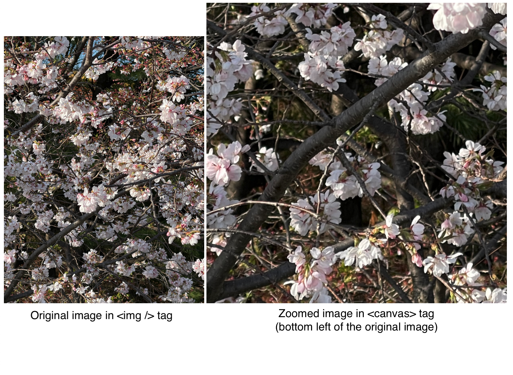

# zoom-in-to-canvas

```
npm install zoom-in-to-canvas
// or
yarn add zoom-in-to-canvas
```

This is a simple library that allows to zoom in part of the image(where you hover your mouse on) of an `` tag and show it on a `<canvas>` tag. You have to create your own `` and `<canvas>` tags with proper `id`s.

Determine the zoom ratio(`zoomRatio`). Send them with the ``'s and `<canvas>`'s id as arguments to the function `zoomIn()`. If you set the option `hoveringSquare` true (which is by default), a translucent rectangle shows which part of the image is being zoomed in.

## Example

```html
<!-- index.html -->

<body>
  
  <canvas id="canvas-to-show-the-image" width="600" height="600">
  <script type="module" src="/src/main.ts"></script>
</body>
```

```ts
/* 
/src/main.ts

zoomIn(zoomRatio(number), imageId(string, id of the  tag), canvasId(string, id of the <canvas> tag), hoveringSquare(boolean, true by default))
*/

zoomIn(3, "image-to-be-extended", "canvas-to-show-the-image");
```


